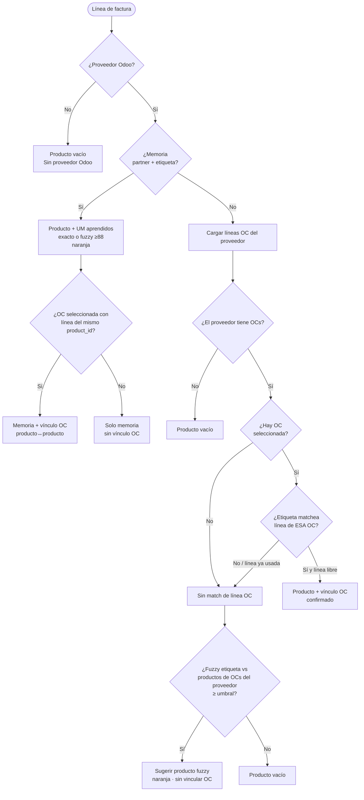

# Documentación del proyecto

Mapa para entender **facturia-matching-ui**: qué hace cada parte, cómo se conectan y dónde mirar al tocar algo.

## Qué es esto

Aplicación web (FastAPI + JS vanilla) que:

1. Lee un proceso de FacturIA desde **MySQL** (`process.json_data`).
2. Matchea proveedor, rubro, diario, cuenta e impuestos contra **PostgreSQL** (padrón) y **Odoo** (catálogos).
3. Muestra una tabla editable con vista por comprobante.
4. Persiste ediciones en **MySQL** (`process_conversions`).
5. Exporta **CSV** o importa borradores a **Odoo TEST**.

## Diagrama de capas

```mermaid
flowchart TB
  subgraph UI["Frontend (static/js)"]
    main[main.js]
    table[table/]
    comp[comprobanteView + comprobanteTax]
    api_js[api/]
  end

  subgraph API["FastAPI (api/routes.py facade)"]
    routes[/api/*]
  end

  subgraph Core["Dominio (core/)"]
    process[process.py]
    tax[comprobante_tax.py]
    amounts[amounts.py]
    opts[options.py]
    const[constants.py]
  end

  subgraph Data["Fuentes de datos"]
    mysql[(MySQL process + conversions)]
    pg[(PostgreSQL padrón)]
    odoo[(Odoo XML-RPC)]
  end

  subgraph Support["Soporte"]
  padron[padron/]
  odoo_mod[odoo/]
  persist[persistence/]
  export[export/]
  infra[infra/]
  end

  main --> api_js --> routes
  routes --> process
  routes --> persist
  routes --> export
  routes --> odoo_mod
  process --> padron
  process --> odoo_mod
  process --> tax
  persist --> mysql
  padron --> pg
  padron --> odoo_mod
  odoo_mod --> odoo
  process --> mysql
```

## Flujo principal (cargar proceso)

```
Usuario ingresa process_number
  → GET /api/proceso/{n}
    → load_process_rows() [persistence/process_conversions.py]
      → ¿hay conversión guardada? → remap_saved_rows_to_catalog()
      → si no → parse_process_json() [core/process.py]
        → get_process() [MySQL]
        → get_catalog() [odoo/catalog.py]
        → match_proveedor() [padron/postgres.py]
        → apply_padron_taxes_to_row() [padron/taxes.py]
        → enrich_rows_with_purchase_data() [odoo/purchase_matching/]
    → build_output_rows() [core/process.py]
  → UI renderiza tabla + pies de comprobante
  → autosave PUT /api/proceso/{n}/conversion
```

## Perfiles Odoo

El parámetro `odoo_profile` (query, body o `perfil`) cambia tenant, padrón y columnas:

| Perfil | Uso típico | Padrón primero | Rubro (`x_studio_category`) |
|--------|------------|----------------|-----------------------------|
| `default` / Dinner | Odoo on-prem Dinner | Postgres | No |
| `aliare` | Tenant Aliare | Odoo → Postgres | Sí (catálogo: todos los contactos, no solo `supplier_rank`) |
| `sudata` | Odoo Cloud Sudata (`odoo_cloud=1`) | Odoo → Postgres | Sí |

Contexto por request: `odoo/request_context.py` + `odoo/env.py`.

**Importante:** los ids de `account.tax` no son portables entre tenants. En Aliare/Sudata la URL y el import deben incluir `odoo_profile` (ej. `?empresa=1&proceso=48&odoo_profile=aliare`). Ver [iva-y-import-odoo.md](iva-y-import-odoo.md).

El padrón Postgres puede traer tax ids de Dinner; `PADRON_TAX_SOURCE_PROFILE` (default `default`) define el tenant fuente para remapear a ids del perfil activo (`padron/taxes.py`).

## Matching de producto (memoria → OC → fuzzy)

Por cada línea de factura, el matching **no** busca en todo el catálogo de Odoo. Solo usa productos de las OCs del proveedor (+ memoria de elecciones pasadas). Detalle: [import-odoo/purchase-oc.md](import-odoo/purchase-oc.md).



Orden corto: **memoria → vínculo OC por mismo product_id (si no, etiqueta) → fuzzy de OCs del proveedor → vacío**.

## Memoria de diario / cuenta / rubro

Al cargar un **proceso nuevo** (sin conversión propia), tras resolver el proveedor se reusa el último `journal_id` / cuenta / rubro guardado en conversiones recientes de la misma empresa+template (`partner_header_memory`, sin tabla dedicada). Prioridad: conversión del proceso → memoria partner → padrón. Ids inválidos para el catálogo activo se ignoran.

## Índice de documentos

| Documento | Contenido |
|-----------|-----------|
| [guia-usuario.md](guia-usuario.md) | **Guía para operadores**: URL, perfil Odoo, pie IVA, import, problemas frecuentes |
| [arquitectura.md](arquitectura.md) | Capas, dependencias, convenciones de filas/columnas |
| [modulos-python.md](modulos-python.md) | Cada paquete y archivo `.py` del backend |
| [modulos-frontend.md](modulos-frontend.md) | Módulos ES6 en `static/js/` |
| [api.md](api.md) | Endpoints REST y payloads (proceso, import, padrón, …) |
| [api-health.md](api-health.md) | Health Odoo / credenciales (sin exponer `uid`) |
| [tests-y-scripts.md](tests-y-scripts.md) | Tests, fixtures y scripts de diagnóstico |
| [iva-y-import-odoo.md](iva-y-import-odoo.md) | IVA por comprobante e import a Odoo (detalle profundo) |
| [import-odoo/](import-odoo/README.md) | **Paquete `odoo/import_/`**: módulos, pipeline, OC, impuestos, API, tests |

## Árbol del repo (resumido)

```
facturia-matching-ui/
├── main.py                 # uvicorn entry (python main.py)
├── src/facturia_matching/
│   ├── main.py             # app FastAPI
│   ├── api/                # routes HTTP
│   ├── core/               # lógica de negocio pura
│   ├── padron/             # matching proveedor + impuestos
│   ├── odoo/               # XML-RPC, catálogo, import_, OC
│   ├── persistence/        # MySQL conversions + back_check
│   ├── export/             # CSV
│   ├── infra/              # config, env, paths, DB resolve
│   └── static/             # html, css, js
├── tests/                  # unit + integration + js
├── scripts/                # utilidades CLI
└── docs/                   # esta carpeta
```

## Dónde empezar según la tarea

| Quiero… | Mirar primero |
|---------|----------------|
| Cambiar columnas de la tabla | `core/constants.py`, `static/js/table/columns.js` |
| Arreglar matching de proveedor | `padron/postgres.py`, `odoo/catalog.py` |
| Impuestos / IVA / IIBB | `padron/taxes.py`, `core/comprobante_tax.py`, [import-odoo/](import-odoo/README.md), [iva-y-import-odoo.md](iva-y-import-odoo.md), [guia-usuario.md](guia-usuario.md) |
| Import a Odoo | [import-odoo/](import-odoo/README.md), `odoo/import_/` |
| Matching con OC / producto / aprendizaje | `odoo/purchase_matching/`, [import-odoo/purchase-matching.md](import-odoo/purchase-matching.md), [import-odoo/purchase-oc.md](import-odoo/purchase-oc.md), diagrama en esta página |
| Guardar / cargar ediciones | `persistence/process_conversions.py`, `static/js/api/autoSave.js` |
| Nuevo endpoint | `api/route_meta.py` / `route_odoo.py` / `route_proceso.py` (+ facade `routes.py`) |
| Variables de entorno | `.env.example`, `infra/config.py`, `odoo/env.py` |
| Paridad JS ↔ Python en taxes | `tests/fixtures/tax_scenarios.json`, `tests/test_js_python_parity.py` |

## Convenciones para IA / contribuidores

- **Filas**: cada línea de factura es un `dict` con claves tipo Odoo (`partner_id`, `invoice_line_ids/name`, …) más metadatos `__*` (`__comprobante_idx`, `__fac_iva_monto`, etc.).
- **Grupos**: un comprobante = filas con mismo `__comprobante_idx` o mismo `l10n_latam_document_number`.
- **Perfil Odoo**: siempre pasar por `odoo_profile_context` en rutas que toquen Odoo o catálogo.
- **Caches**: padrón Postgres, padrón Odoo, catálogo Odoo e impuestos tienen cache en memoria; invalidar en tests con helpers `reset_*` / `invalidate_catalog_cache`.
- **Paridad fiscal**: cambios en `comprobante_tax.py` suelen requerir el espejo en `static/js/comprobanteTax/` y fixtures compartidos.
