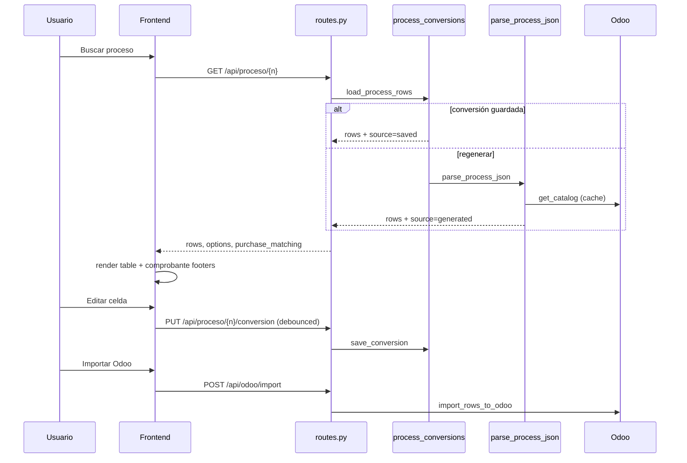

# Arquitectura

## Stack

| Capa | Tecnología |
|------|------------|
| Servidor | Python 3.11+, FastAPI, uvicorn |
| Frontend | HTML/CSS + ES modules (sin bundler) |
| Proceso FacturIA | MySQL (`sudataco_facturia.process`) |
| Padrón | PostgreSQL (vistas) y/o histórico Odoo |
| ERP | Odoo vía XML-RPC / JSON-RPC |
| Tests Python | `unittest` (`python -m unittest discover`) |
| Tests JS | Node test runner (`npm run test:js`) |

## Capas y responsabilidades

### `api/` — HTTP

Único punto de entrada REST. No contiene lógica de negocio pesada: delega en `core/`, `persistence/`, `odoo/`, `export/`.

Resuelve `odoo_profile` por request y lo inyecta con `odoo_profile_context`.

### `core/` — Dominio

Lógica independiente de HTTP y de drivers concretos (salvo imports puntuales a catálogo/padrón):

- Parseo JSON FacturIA → filas UI.
- Cálculo de montos, IVA, modos de comprobante.
- Definición de columnas y opciones de dropdown.

### `padron/` — Matching local

- **postgres.py**: vista `view_padron_facturia` (+ fallback), fuzzy match por CUIT/nombre.
- **odoo.py**: padrón derivado de últimas facturas posteadas en Odoo.
- **taxes.py**: impuestos del padrón fiscal, resolución de labels → `account.tax` id, IVA por alícuota.

### `odoo/` — Integración ERP

- **env.py**: credenciales por perfil (Dinner / Aliare / Sudata).
- **api.py**: autenticación, `search_read`, helpers XML-RPC.
- **catalog.py**: proveedores (Dinner/Sudata: `supplier_rank > 0`; Aliare: todos los contactos), diarios, cuentas, rubros, tipos de documento (cache TTL).
- **import_/**: agrupar filas en facturas, crear/actualizar `account.move`, sync de impuestos y OC. Ver [import-odoo/](import-odoo/README.md).
- **purchase_matching.py**: sugerir y aplicar órdenes de compra.

### `persistence/` — Estado editado

- **back_check.py**: leer fila de `process` en MySQL.
- **process_conversions.py**: guardar/cargar JSON de filas en `process_conversions` (template por perfil).
- **saved_row_remap.py**: al recargar conversión, re-mapear IDs de catálogo si cambiaron.

### `export/` — Salida

- **csv_export.py**: columnas Odoo import format + impuestos dinámicos `otros_impuestos_N`.

### `infra/` — Configuración transversal

- **config.py**: conexiones PG/MySQL, nombres de tablas/vistas.
- **env.py**: lectura segura de variables.
- **db_resolve.py**: resolver nombre de base PG cuando `DB_NAME` está vacío.
- **paths.py**: rutas a `static/`, `.env`.
- **normalization.py**: fechas, CUIT, números de comprobante.

### `static/` — UI

SPA ligera: estado en memoria (`core/state.js`), render incremental de tabla y bloques por comprobante.

## Modelo de datos: una fila

Cada fila del array `rows` es un objeto plano. Claves importantes:

### Identidad y agrupación

| Clave | Descripción |
|-------|-------------|
| `l10n_latam_document_number` | Número de comprobante |
| `__comprobante_idx` | Índice de grupo (0, 1, 2…) |
| `__line_idx` | Índice de línea dentro del comprobante |

### Cabecera de factura (repetida o propagada)

`partner_id`, `CUIT`, `l10n_latam_document_type_id`, `invoice_date`, `invoice_date_due`, `journal_id`, `x_studio_category` (si perfil lo soporta).

### Línea

`invoice_line_ids/name`, `invoice_line_ids/product_id`, `invoice_line_ids/account_id`, `invoice_line_ids/quantity`, `invoice_line_ids/price_unit`, `iva_pct`, `iva_monto`.

### Montos FacturIA (encabezado)

`__fac_subtotal`, `__fac_iva_monto`, `__fac_iva_montos` (JSON por alícuota; valores en formato es-AR aceptados), `otros_impuestos_monto`, slots `otros_impuestos_N` / `otros_impuestos_N_monto`.

**Otros impuestos — reglas de columnas:**

- Slot 1 (`otros_impuestos`): puede tener solo etiqueta del padrón.
- Slots `_2..N`: solo si hay monto > 0 en alguna fila (no se generan columnas vacías por ids del padrón).
- Al cargar conversión guardada: `_strip_empty_extra_otro_impuesto_slots` limpia legacy.
- Metadata padrón: `_padron_other_tax_ids` conserva todos los ids no-IVA para import aunque la UI muestre una sola columna.

### Purchase matching

`__purchase_order_id`, `__purchase_line_id`, `invoice_line_ids/purchase_line_id`, campos de resumen en `purchase_matching` a nivel respuesta API.

Solo entran OCs con recepción iniciada: `fetch_partner_po_lines` filtra `purchase.order` con `receipt_status != pending` (en la UI de Odoo, estado de entrega distinto de «No recibido»). Detalle en [import-odoo/purchase-oc.md](import-odoo/purchase-oc.md#filtro-de-ocs-en-matching).

### Solo UI (pueden no persistir)

`__iva_monto_manual`, flags de modo tax en `state.comprobanteTaxModes`.

Lista completa de columnas export/UI: `core/constants.py` → `OUTPUT_HEADERS`, `output_headers_for_profile()`.

## Ciclo de vida de una sesión



## Caching

| Cache | Módulo | Invalidación |
|-------|--------|--------------|
| Catálogo Odoo | `odoo/catalog.py` | `invalidate_catalog_cache()` |
| Padrón PG | `padron/postgres.py` | `reset_padron_cache()` |
| Padrón Odoo | `padron/odoo.py` | `reset_padron_odoo_cache()` |
| Impuestos padrón | `padron/taxes.py` | `clear_tax_padron_cache()` |
| Tax names Odoo | `padron/taxes.py` | `clear_odoo_tax_catalog_cache()` |

En desarrollo con `--reload`, los procesos hijos de uvicorn resetean caches al reiniciar.

## Multi-tenant / perfiles

`odoo/env.py` construye `build_odoo_main_config(profile)` y `build_odoo_import_config(profile)`:

- **default**: `ODOO_BASE_URL`, `ODOO_USER`, `ODOO_PASSWORD` / `ODOO_API_KEY`
- **aliare**: sufijo `_ALIARE`
- **sudata**: sufijo `_SUDATA` o flag `odoo_cloud`

`get_conversion_template_id()` asocia cada perfil a un `export_templates.id` en MySQL (99 default, ids Aliare/Sudata en env).

### Impuestos multi-tenant

- Resolución de IVA y percepciones: catálogo `account.tax` del perfil activo (`padron/taxes.py`).
- Padrón Postgres con ids numéricos legacy: remapeo con `PADRON_TAX_SOURCE_PROFILE` (tenant fuente, default Dinner).
- Import: pie del comprobante manda en header/mixed; sobreescritura de montos en líneas `display_type=tax` al final de `sync_move_taxes_from_group`. En la UI, un `iva_monto` fijo en línea no se recalcula al cambiar precio (ver [iva-y-import-odoo.md](iva-y-import-odoo.md#iva-fijo-al-cambiar-precio-o-cantidad)). Detalle en [iva-y-import-odoo.md](iva-y-import-odoo.md).

## Despliegue

- `main.py` en raíz: lee `PORT`, `HOST`, `RELOAD`.
- `deploy.sh` / `deploy_aliare.sh`: Cloud Run.
- Assets estáticos montados en `/static`, `/css`, `/js` sin hash (cache bust manual con `?v=mtime` en `index.html`).

## Dependencias entre paquetes (regla práctica)

```
api → core, persistence, export, odoo, padron, infra
core → padron, odoo (catalog), persistence (back_check)
persistence → infra, odoo.env
padron → infra, odoo (opcional)
odoo → infra
export → core.constants
```

Evitar que `core` importe `api`. Evitar que `padron` importe `persistence`.
