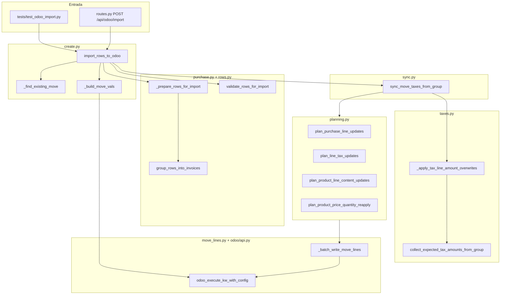

# Import a Odoo (`odoo/import_/`)

Documentación del paquete que convierte filas de la UI en facturas de proveedor (`account.move`, `move_type=in_invoice`) en Odoo y sincroniza impuestos, montos y vínculos de orden de compra.

**Código:** `src/facturia_matching/odoo/import_/`

**Entrada HTTP:** `POST /api/odoo/import` → `import_rows_to_odoo` en [`api/routes.py`](../../src/facturia_matching/api/routes.py).

---

## Qué hace en una frase

1. Agrupa filas UI por comprobante.
2. Valida cabecera y líneas.
3. Refresca y sanea vínculos OC contra Odoo.
4. Crea borradores nuevos o actualiza duplicados (partner + número de documento).
5. Sincroniza encabezado, líneas de producto, `tax_ids`, vínculos OC, precio/cantidad final y **después** montos en líneas `display_type=tax` (IVA / IIBB del pie).

---

## Índice de esta carpeta

| Documento | Contenido |
|-----------|-----------|
| [arquitectura.md](arquitectura.md) | Por qué es un paquete, grafo de dependencias, reglas de diseño |
| [modulos.md](modulos.md) | Referencia archivo por archivo (funciones, responsabilidades) |
| [pipeline.md](pipeline.md) | Flujo paso a paso: `import_rows_to_odoo` y `sync_move_taxes_from_group` |
| [impuestos.md](impuestos.md) | `tax_ids`, montos esperados, sobreescritura en líneas tax, IIBB |
| [purchase-oc.md](purchase-oc.md) | Refresh OC, sanitize, dedupe, `purchase_line_id`, precio tras vínculo |
| [api-publica.md](api-publica.md) | Símbolos exportados, quién importa qué, contrato de respuesta |
| [testing.md](testing.md) | Tests, `mock.patch` por submódulo, comandos útiles |

**Complemento fiscal (UI + modos IVA):** [iva-y-import-odoo.md](../iva-y-import-odoo.md) — sigue siendo la guía de dominio IVA; este paquete es la implementación Odoo.

---

## Árbol del paquete

```
src/facturia_matching/odoo/import_/
├── __init__.py      # Reexporta API pública (mismo path que el antiguo import_.py)
├── _utils.py        # Parsing, IDs, cache purchase_line_id en fields_get
├── rows.py          # Agrupación, validación, comandos de línea Odoo
├── purchase.py      # OC: refresh, sanitize, dedupe, _prepare_rows_for_import
├── taxes.py         # tax_ids, montos esperados, líneas tax, date_maturity
├── planning.py      # Funciones plan_* (diff UI ↔ Odoo antes de escribir)
├── move_lines.py    # Lectura de líneas + batch write vía account.move
├── sync.py          # sync_move_taxes_from_group (orquestación post-create)
└── create.py        # Crear move, buscar duplicados, import_rows_to_odoo
```

---

## Diagrama de capas



---

## Dependencias externas (fuera del paquete)

| Paquete | Uso en import |
|---------|----------------|
| `odoo/api.py` | XML-RPC: `get_odoo_import_config`, `odoo_execute_kw_with_config` |
| `odoo/env.py` | Perfil activo, `supports_rubro_field` |
| `odoo/purchase_matching.py` | `_refresh_purchase_links` → `enrich_rows_with_purchase_data` (excluye OCs `receipt_status=pending`) |
| `core/comprobante_tax.py` | `reconcile_fac_iva_for_import`, modos line/header/mixed |
| `padron/taxes.py` | Resolución `account.tax` id, IVA, IIBB, `build_csv_tax_ids_dot_id` |

---

## Dónde empezar según la tarea

| Quiero… | Mirar primero |
|---------|----------------|
| Entender el flujo completo | [pipeline.md](pipeline.md) |
| Arreglar IVA / IIBB en Odoo | [impuestos.md](impuestos.md), [iva-y-import-odoo.md](../iva-y-import-odoo.md) |
| Arreglar precio tras vincular OC | [purchase-oc.md](purchase-oc.md), `planning.plan_product_price_quantity_reapply` |
| OC no aparece / filtro recepción | [purchase-oc.md](purchase-oc.md#filtro-de-ocs-en-matching), `purchase_matching._partner_po_search_domain` |
| Duplicados / ref / latam doc number | `create._find_existing_move`, [modulos.md](modulos.md#createpy) |
| Fecha límite en apuntes AP/AR | `taxes._ensure_move_line_maturity`, [impuestos.md](impuestos.md#fecha-límite-date_maturity) |
| Añadir un paso al sync | [sync.py](../../src/facturia_matching/odoo/import_/sync.py), [pipeline.md](pipeline.md#sync_move_taxes_from_group) |
| Escribir o arreglar tests | [testing.md](testing.md) |

---

## Historial

El paquete reemplazó un único archivo `import_.py` (~1.800 líneas). El path de importación **`from facturia_matching.odoo.import_ import …`** no cambió: `import_` pasó de módulo a paquete con `__init__.py` que reexporta la API pública.
