# Impuestos en el import Odoo

Cómo el paquete `import_` traduce IVA, IIBB y percepciones de filas UI a `tax_ids` y montos en `account.move.line`.

**Dominio fiscal (modos line/header/mixed, UI):** [iva-y-import-odoo.md](../iva-y-import-odoo.md)

**Código principal:** `taxes.py`, `planning.plan_line_tax_updates`, `sync.sync_move_taxes_from_group`

---

## Dos mecanismos en Odoo

| Mecanismo | Campo / línea | Qué controla el import |
|-----------|---------------|-------------------------|
| **tax_ids en línea de producto** | `invoice_line_ids` / líneas sin `display_type=tax` | Qué impuestos aplica Odoo (IVA %, exento, IIBB en 1ª línea) |
| **Montos en líneas tax** | `display_type=tax` | Cuánto debit/credit en cada impuesto (pie FacturIA) |

En modos **header/mixed**, el IVA numérico suele ir solo en el pie → montos en líneas tax. En **line**, suma `iva_monto` por fila.

---

## `_tax_ids_for_odoo_line`

Función central en `taxes.py`. Usada en:

- `_build_line_command` (create)
- `plan_line_tax_updates`
- `_ensure_missing_tax_lines_on_move`

### Reglas (resumen)

| Modo comprobante | IVA numérico en línea | Exento / No Gravado | IIBB comprobante |
|------------------|----------------------|---------------------|------------------|
| `header` | No en `tax_ids` | Sí en línea | Primera línea con contenido |
| `line` | Sí si `iva_pct` lo requiere | Sí | Primera línea (si header/mixed merge) |
| `mixed` | Por fila según `iva_pct` | Sí | Primera línea con contenido |

Implementación:

- `_filter_iva_tax_ids_for_row` + `iva_pct_requires_line_tax` (`padron/taxes.py`)
- `_merge_comprobante_non_iva_tax_ids` + `_comprobante_non_iva_tax_ids`

### IIBB en primera línea

Percepciones a nivel comprobante (incluso en fila solo encabezado `__solo_encabezado`) se consolidan con `_comprobante_non_iva_tax_ids` y se añaden a la **primera fila con contenido** en modos header/mixed.

Tests: `test_plan_line_tax_updates_puts_iibb_on_first_content_line`, `test_collect_expected_iibb_from_header_only_row`.

---

## `collect_expected_tax_amounts_from_group`

Devuelve `Dict[int, float]` — `account.tax` id → monto esperado en Odoo.

### Modo `line`

Por cada fila con contenido:

- `line_iva_monto(row)` si > 0
- Resuelve id IVA con `tax_id_for_csv_export` o primer id IVA en `tax_ids` de la fila

### Modo `header` / `mixed`

- `fac_iva_montos(group)` — respeta pie `__fac_iva_montos` / `__fac_iva_monto`
- Cada alícuota → `_iva_tax_id_for_rate(rate_key, _iva_tax_resolve_row(group))`

### Otros impuestos (IIBB, percepciones)

Por cada fila del grupo, slots `otros_impuestos_N` / `otros_impuestos_N_monto`:

- `resolve_tax_label_to_id(label)` o fallback a ids no-IVA de la fila / `_padron_other_tax_ids`

---

## Sobreescritura de montos tax

### `plan_tax_line_amount_overwrites`

Empareja líneas Odoo `display_type=tax` por `tax_line_id` con `expected_amounts`. Tolerancia default 0.02.

Warning si hay monto esperado sin línea tax en Odoo.

### `_ensure_missing_tax_lines_on_move`

Si falta línea tax para un id esperado:

1. Refuerza `tax_ids` en la **primera línea de producto** (añade ids faltantes)
2. Odoo regenera líneas tax en el siguiente recálculo
3. Luego `_apply_tax_line_amount_overwrites` pisa montos

Alias retrocompatible: `_ensure_iibb_tax_lines_on_move`.

### `_tax_line_amount_write_vals`

Determina debit vs credit según signo de `balance`/`credit` existente. Opcionalmente setea `date_maturity` si la cuenta del impuesto es AP/AR.

---

## Fecha límite (`date_maturity`)

Odoo exige `date_maturity` en apuntes de cuentas por pagar/cobrar aunque el encabezado tenga `invoice_date_due`.

El import:

1. Escribe `invoice_date_due` en `account.move` (`plan_move_header_updates`)
2. `_ensure_move_line_maturity` — busca líneas del move sin `date_maturity` en cuentas AP/AR
3. Al pisar montos tax, `_tax_line_amount_write_vals` puede añadir `date_maturity` en la línea tax

Si persiste error tras deploy: revisar `account_type` de la cuenta usada por el impuesto IIBB en Odoo.

---

## Interacción con `reconcile_fac_iva_for_import`

Se ejecuta en `_prepare_rows_for_import` **antes** de create/sync.

| Situación | Efecto |
|-----------|--------|
| header/mixed con pie editado | No recalcula `__fac_iva_montos` desde líneas |
| line con `__iva_monto_manual` | Regenera JSON desde líneas |
| line sin edición manual en pie | Sincroniza JSON desde `iva_monto` |

Sin esto, `collect_expected_tax_amounts_from_group` podría leer montos viejos y Odoo no reflejaría el pie.

---

## Perfil Odoo y remapeo

Los ids en filas UI deben corresponder al **perfil activo** (`odoo_profile` en URL/request).

- IVA: `resolve_iva_tax_id_for_pct`, `tax_id_for_csv_export`
- Padrón con ids Dinner en Aliare: `PADRON_TAX_SOURCE_PROFILE` + remapeo en `padron/taxes.py`

Ver [iva-y-import-odoo.md § Perfil Odoo](../iva-y-import-odoo.md#perfil-odoo-odoo_profile).

---

## Diagrama flujo impuestos en sync

```mermaid
flowchart LR
  A[plan_line_tax_updates] --> B[batch write tax_ids]
  B --> C[plan_purchase_line_updates]
  C --> D[_apply_tax_line_amount_overwrites]
  D --> E[collect_expected_tax_amounts]
  E --> F[ensure_missing_tax_lines]
  F --> G[plan_tax_line_amount_overwrites]
  G --> H[batch write montos tax]
  H --> I[plan_product_price_quantity_reapply]
```



---

## Tests relacionados

| Test | Qué verifica |
|------|----------------|
| `test_comprobante_tax.py` | Modos, `collect_expected_*` con pie |
| `test_iva_tax_resolve.py` | Resolución IVA Dinner vs Aliare |
| `test_tax_pipeline.py` | Pipeline fiscal end-to-end |
| `test_padron_taxes_iibb.py` | IIBB en montos esperados |
| `test_odoo_import.py` | tax_ids, IIBB primera línea, montos, maturity |

Comando:

```bash
PYTHONPATH=src python -m pytest tests/test_odoo_import.py tests/test_comprobante_tax.py tests/test_iva_tax_resolve.py -q
```
