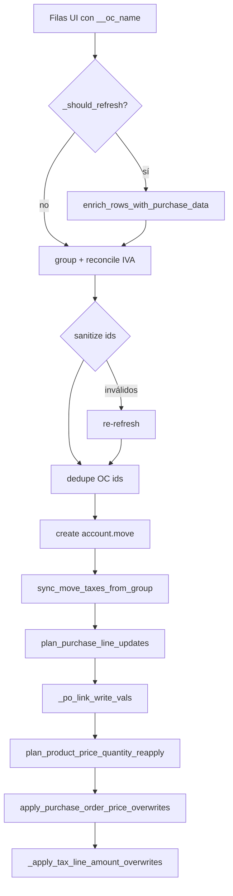

# Purchase orders (OC) en el import

Vínculo entre filas UI y `purchase.order.line` en Odoo (`purchase_line_id`).

**Código:** `purchase.py`, `planning._po_link_write_vals`, `planning.plan_product_price_quantity_reapply`

**Matching previo (enriquecer filas):** `odoo/purchase_matching.py`

---

## Filtro de OCs en matching

`fetch_partner_po_lines` (`purchase_matching.py`) trae órdenes de compra **confirmadas** del proveedor, **incluyendo recepcionadas y no recepcionadas**.

| Odoo (`purchase.order`) | UI (español) | ¿Se considera? |
|-------------------------|--------------|----------------|
| `receipt_status = pending` | Estado de entrega **No recibido** | Sí (label «No recepcionada») |
| `receipt_status = partial` | Parcialmente recibido | Sí («Parcialmente recepcionada») |
| `receipt_status = full` | Recibido | Sí («Recepcionada») |
| `receipt_status = False` | Sin recepciones / sin stock | Sí |

Dominio en `_partner_po_search_domain`:

```python
[
    ("partner_id", "child_of", scope_id),
    ("state", "in", ["purchase", "done"]),
]
```

**UI final (por comprobante):** los controles viven en una franja del **header de cada tarjeta de factura**, encima de la tabla.

- A la izquierda se muestra un botón `secondary` **«Buscar OCs similares»**. Después de buscar pasa a **«OC: {nombre} ▾»**; si se elige no vincular, queda **«OC: Sin OC ▾»** (sin anteponer el número de factura). `↻` fuerza una búsqueda nueva.
- A la derecha está el checkbox **«Sobreescribir precio de la OC»**: el texto aparece arriba y la tilde debajo. Se muestra deshabilitado mientras no haya una OC seleccionada.
- El botón aparece cuando el comprobante tiene proveedor y todavía no se confirmó que no tenga OCs. Tras `rematch-purchase`, se oculta solo si Odoo confirmó `oc_provider_has_ocs_by_comprobante[comp]=false`; si el nuevo proveedor tiene OCs, aparece dinámicamente.
- Al abrir el selector sin candidatos en memoria, el frontend vuelve a ejecutar `search-oc` antes de abrir el modal.

Si el operador elige **«Sin OC»**, se limpian los vínculos de líneas y el checkbox queda deshabilitado, pero se conservan candidatos / flags de búsqueda: el selector queda como **«OC: Sin OC ▾»** y no desaparece.

**Carga inicial:** `enrich_rows_with_purchase_data(..., fetch_candidates=False)` no lista candidatos ni auto-elige la mejor OC; solo re-aplica una OC guardada válida (`__selected_oc_order_id`).

**Efecto histórico (cambio):** antes se excluían OCs `receipt_status=pending`; ahora se listan con label para que el operador decida.

---

## Sugerencia de producto por fuzzy (sin vincular OC)

No todas las líneas de factura terminan vinculadas a una línea de OC (proveedor sin OC seleccionada, o línea que no matchea la OC elegida). Para esos casos se **sugiere** el `invoice_line_ids/product_id` haciendo fuzzy de la etiqueta contra los **productos de las OC del proveedor** (`fetch_partner_po_lines`, ya en memoria: sin llamadas extra a Odoo).

**Código:** `_suggest_product_from_pool` + rama "sin match OC" de `match_invoice_row(..., suggest_pool=po_lines)`; `_match_comprobante_rows` pasa las líneas de todo el proveedor como `suggest_pool`.

**Cuándo aplica** (solo si la línea quedó sin producto propio):

- Comprobante **con OC** seleccionada pero la línea **no matcheó** ninguna línea de esa OC.
- Comprobante **sin OC** seleccionada pero el **proveedor sí tiene OCs**.

**Reglas:**

- Umbral igual al de OC (`_min_match_score`: 70 con código de ítem, 75 sin código).
- **No** setea `__oc_line_id` ni `__oc_order_id` (no vincula OC, solo sugiere producto).
- Setea `__product_suggested` (score) y `__oc_match_note = "Producto sugerido (fuzzy N%)"`.
- Si la fila ya trae `invoice_line_ids/product_id`, se respeta (no se sugiere encima).

**UI:** la celda de producto sugerida se muestra **resaltada en naranja** (`combobox-suggested`) con tooltip "revisá antes de importar". Al elegir/borrar el producto manualmente se limpia el flag y el resaltado (`combobox/attach.js`).

Tests: `test_match_invoice_row_suggests_product_from_pool_without_oc`, `test_match_invoice_row_no_suggestion_below_threshold` en `tests/test_purchase_matching.py`.

Tests: `test_partner_po_search_domain_includes_all_receipt_statuses`, `test_fetch_partner_po_lines_includes_receipt_and_deliver_fields`, `test_search_oc_candidates_for_comprobante`, `test_apply_oc_selection_sin_oc_clears_match` en `tests/test_purchase_matching.py`.

---

## Campos en filas UI

| Campo | Origen | Uso en import |
|-------|--------|----------------|
| `__oc_line_id` | `purchase_matching` / selección UI | `purchase_line_id` en Odoo |
| `__oc_name` | Nombre PO | `invoice_origin`, warnings |
| `__oc_order_id` | Id orden | Metadata |
| `__selected_oc_name` | Picker UI | Prioridad en `invoice_origin` |
| `invoice_line_ids/product_id` | FacturIA / OC / **sugerencia fuzzy** | Producto al vincular OC o sugerido desde OCs del proveedor |
| `__product_suggested` | `match_invoice_row` (fuzzy) | Marca producto sugerido (no confirmado); resalte naranja en UI |
| `__overwrite_oc_price` | Checkbox UI por comprobante | Si truthy (`1`/`true`), al importar escribe `price_unit` en `purchase.order.line` |
| `__um_empresa` / `__um_empresa_id` | Matching UM (categoría del producto / `product_uom` de OC) | `product_uom_id` en la línea de factura al importar |
| `__um_proveedor`, `__qty_escalada`, `__um_note` | Escalado qty factura → UM empresa | UI / debug; qty re-escrita en `invoice_line_ids/quantity` si hubo re-escalado |

El **precio** y la **cantidad** de la **factura** vienen de `invoice_line_ids/price_unit` y `invoice_line_ids/quantity` — no del precio de la PO. El matching OC no pisa precio (solo producto, metadata y UM).

### Sobreescribir precio de la OC original

Por defecto el import **no** modifica la orden de compra en Odoo: solo deja el precio de FacturIA en la factura (vía reapply).

Si el operador marca el checkbox **«Sobreescribir precio de la OC»** en el header del comprobante:

1. Se persiste `__overwrite_oc_price=1` en las filas del comprobante (autosave).
2. Tras vincular OC y re-aplicar precio en la factura, `apply_purchase_order_price_overwrites` escribe `price_unit` en cada `purchase.order.line` vinculada (`__oc_line_id`), con el precio de la tabla UI.
3. Solo escribe si difiere (tolerancia 0.001). Errores de Odoo → warning, no abortan el import.
4. Al deseleccionar OC / rematch, el flag se limpia con el resto de campos purchase.

**UI:** controles OC + checkbox viven en el **header de cada tarjeta de factura** (la barra global quedó legacy/oculta). El checkbox siempre se renderiza; sin OC queda deshabilitado. Su etiqueta está arriba y la tilde debajo.

Tests: `test_apply_purchase_order_price_overwrites_*`, `test_group_wants_overwrite_oc_price`.

### Unidad de medida (UM)

Flujo:

1. Detectar / asignar `invoice_line_ids/product_id` (OC, fuzzy o manual).
2. Resolver la UM de la factura contra las UOMs de la **categoría** del producto en Odoo (`uom.uom` con mismo `category_id` que `uom_po_id` / `uom_id`). Con OC vinculada se usa además `product_uom` de la línea PO.
3. Si hace falta, re-escalar `invoice_line_ids/quantity` a la UM empresa y guardar `__um_empresa_id`.
4. Al importar, `_build_line_command` / sync escriben `product_uom_id` en `account.move.line` (create, contenido, vínculo OC y reapply final).

**No se escribe** `product_uom_id` cuando:

- El mapeo falló (`UM sin mapeo` / `Categoría UM distinta`): la cantidad sigue en la UM de factura y Odoo usa el default del producto.
- La fila **no tiene** `invoice_line_ids/product_id` (ej. el usuario borró el producto tras el matching): una UM huérfana podría violar la restricción de categoría UOM de Odoo. La UI (`combobox/attach.js`) limpia `__um_empresa_id` al cambiar o borrar el producto.

**Caches por tenant:** `_po_cache`, `_product_uom_cache` y `_uom_cache` se indexan por `base_url|db` — los ids de `uom.uom` / `product.product` no son portables entre perfiles Odoo (Dinner/Aliare/Sudata). `clear_purchase_cache()` limpia todo.

Tests: `test_apply_uom_scaling_sets_empresa_id`, `test_build_line_command_includes_matched_product_uom`, `test_plan_product_line_content_updates_product_uom`, `test_plan_product_price_quantity_reapply_restores_uom`, `test_uom_not_written_without_product`.

---

## Soporte por tenant

`_move_line_supports_purchase_link` (`_utils.py`):

- Hace `fields_get` en `account.move.line` una vez por `base_url|db`
- Si no existe `purchase_line_id` → todo el flujo OC se omite (ej. Odoo Cloud Sudata sin módulo purchase)

Cache: `_MOVE_LINE_PURCHASE_LINK_CACHE` — limpiar en tests.

---

## `_prepare_rows_for_import` — fase OC

### ¿Cuándo refresh?

`_should_refresh_purchase_links` → true si alguna fila con contenido tiene nombre OC pero **no** tiene `__oc_line_id`.

Evita round-trip innecesario cuando el cliente ya envió ids.

### Refresh

`_refresh_purchase_links`:

```python
clear_purchase_cache()
enrich_rows_with_purchase_data(rows)
```

Warning si `rows_matched < rows_total`.

### Sanitize

`sanitize_group_purchase_lines` — para cada `__oc_line_id`, verifica existencia en `purchase.order.line.search`. Si no existe:

- Limpia `__oc_line_id`, `__oc_line_name`, `__oc_order_id`
- Warning con nombre de línea y OC

Si hubo sanitize → **segundo** refresh + re-agrupación.

### Dedupe

`_dedupe_group_oc_line_ids` — Odoo no permite dos líneas de factura con el mismo `purchase_line_id`. La segunda fila pierde el vínculo + warning.

---

## En `sync_move_taxes_from_group`

### Plan

`plan_purchase_line_updates(product_lines, group, config=config)`:

- Empareja por **orden** (primera línea UI ↔ primera línea Odoo, etc.)
- Solo propone cambio si `expected __oc_line_id != current purchase_line_id`
- **No** propone quitar vínculo (`purchase_line_id=False`) — Odoo puede fallar con FK

### Write

`_po_link_write_vals` por línea:

```python
{
  "purchase_line_id": po_line_id,
  "price_unit": ...,      # desde UI
  "quantity": ...,        # desde UI
  "product_id": ...,      # si hay en fila
  "product_uom_id": ...,  # si hay `__um_empresa_id` matcheada
}
```

`_batch_write_move_lines_with_fallback` — si el batch falla, reintenta línea a línea (errores comunes en OC).

### Después del vínculo

1. `plan_product_price_quantity_reapply` — restaura precio/cantidad/UM UI (Odoo puede haber puesto el precio/UM de la PO)
2. `apply_purchase_order_price_overwrites` — **opcional** (`__overwrite_oc_price`): pisa `price_unit` en la OC original
3. `_apply_tax_line_amount_overwrites` — **último paso** sobre la factura: pisa montos IVA / IIBB del pie de FacturIA

**Regresión corregida (IIBB CABA):** si los montos tax se aplicaban antes del reapply de precio, Odoo recalculaba la percepción y el primer import quedaba mal; el segundo clic “arreglaba” porque el precio ya no cambiaba.

---

## `plan_product_price_quantity_reapply`

Último paso del sync de líneas de producto (si purchase soportado).

- Empareja por `purchase_line_id` si la fila UI tiene `__oc_line_id`
- Fallback por índice en filas con contenido
- Evita usar la misma línea Odoo dos veces (`used_line_ids`)
- Solo escribe `price_unit`, `quantity` y `product_uom_id` si difieren (tolerancia 0.001 en montos)

**Regresión histórica:** sin este paso, Odoo dejaba el precio de la línea PO tras vincular.

Tests:

- `test_plan_product_price_quantity_reapply_po_price_differs`
- `test_plan_product_price_quantity_reapply_skips_without_po_link`
- `test_plan_product_price_quantity_reapply_skips_unchanged`
- `test_plan_product_price_quantity_reapply_restores_uom`

---

## `invoice_origin`

`_invoice_origin_from_group` (`rows.py`):

1. Si hay `__selected_oc_name` en cualquier fila → ese valor
2. Si no, une `__oc_name` únicos de líneas con contenido

`plan_invoice_origin_update` compara con el encabezado Odoo actual.

---

## Create inicial sin OC

`_build_move_vals` crea líneas con `include_purchase_link=False` y `include_product_id=False`. Los vínculos OC se aplican solo en sync (factura ya en borrador).

Motivo: evitar fallos de FK y permitir batch de contenido + taxes antes de OC.

---

## Diagrama



---

## Troubleshooting

| Síntoma | Causa probable | Acción |
|---------|----------------|--------|
| OC no vincula | Sin `__oc_line_id` | Refresh / rematch en UI |
| OC no aparece en picker | No se ejecutó «Buscar OCs similares», Odoo no está configurado o el proveedor no tiene OCs confirmadas | Usar el botón; verificar perfil/credenciales, partner y estado purchase/done |
| Warning id no existe | PO borrada en Odoo | Re-matchear o quitar OC |
| Warning OC duplicada | Dos filas mismo `__oc_line_id` | Dedupe quitó uno |
| Precio = PO | Sync viejo sin reapply | Redeploy + re-import draft |
| Precio OC no cambió | Checkbox sin marcar o sin `__oc_line_id` | Marcar «Sobreescribir precio de la OC» e importar |
| Warning al escribir precio OC | Odoo bloqueó write en PO confirmada | Revisar permisos / estado de la OC en Odoo |
| IIBB / CABA mal al 1.er import, bien al 2.º | Montos tax antes de reapply precio | Redeploy + re-import draft |
| Sin purchase en Sudata | `_move_line_supports_purchase_link` false | Esperado; import sin OC |

---

## Tests

`tests/test_odoo_import.py`:

- `test_sanitize_group_purchase_lines_clears_missing_ids`
- `test_prepare_rows_for_import_refreshes_oc_before_grouping`
- `test_plan_purchase_line_updates_*`
- `test_dedupe_group_oc_line_ids_keeps_first_only`
- `test_plan_product_price_quantity_reapply_*`
- `test_apply_purchase_order_price_overwrites_*`
- `test_group_wants_overwrite_oc_price`

`tests/test_purchase_matching.py`:

- `test_search_oc_candidates_for_comprobante`
- `test_score_oc_candidates_lists_ocs_without_content_rows`
- `test_enrich_keeps_saved_oc_when_po_fetch_empty`
- `test_apply_oc_selection_sin_oc_clears_match` (el selector sigue visible después de «Sin OC»)

Patch paths: [testing.md](testing.md#mockpatch-rutas-por-submódulo).
