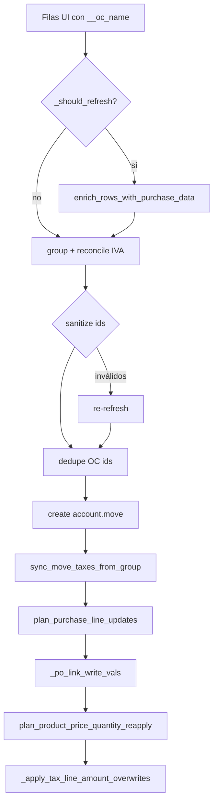

# Purchase orders (OC) en el import

Vínculo entre filas UI y `purchase.order.line` en Odoo (`purchase_line_id`).

**Código:** `purchase.py`, `planning._po_link_write_vals`, `planning.plan_product_price_quantity_reapply`

**Matching previo (enriquecer filas):** `odoo/purchase_matching.py`

---

## Filtro de OCs en matching

`fetch_partner_po_lines` (`purchase_matching.py`) solo trae órdenes de compra **con recepción iniciada** en Odoo.

| Odoo (`purchase.order`) | UI (español) | ¿Se considera? |
|-------------------------|--------------|----------------|
| `receipt_status = pending` | Estado de entrega **No recibido** | No |
| `receipt_status = partial` | Parcialmente recibido | Sí |
| `receipt_status = full` | Recibido | Sí |
| `receipt_status = False` | Sin recepciones / sin stock | Sí |

Dominio en `_partner_po_search_domain`:

```python
[
    ("partner_id", "child_of", scope_id),
    ("state", "in", ["purchase", "done"]),
    ("receipt_status", "!=", "pending"),
]
```

**Efecto:** auto-match, picker (`ocPicker/`) y rematch no listan OCs sin nada recibido. Si `__selected_oc_order_id` guardado apunta a una OC «No recibido», se ignora y se elige la mejor candidata disponible (mismo comportamiento que una OC borrada o de otro tenant).

**Motivo de negocio:** facturar contra una OC que aún no tiene mercadería recibida suele ser incorrecto; el filtro evita vínculos espurios.

Tests: `test_partner_po_search_domain_excludes_unreceived`, `test_fetch_partner_po_lines_filters_unreceived_orders` en `tests/test_purchase_matching.py`.

---

## Campos en filas UI

| Campo | Origen | Uso en import |
|-------|--------|----------------|
| `__oc_line_id` | `purchase_matching` / selección UI | `purchase_line_id` en Odoo |
| `__oc_name` | Nombre PO | `invoice_origin`, warnings |
| `__oc_order_id` | Id orden | Metadata |
| `__selected_oc_name` | Picker UI | Prioridad en `invoice_origin` |
| `invoice_line_ids/product_id` | FacturIA / padrón | Producto al vincular OC |

El **precio** y la **cantidad** vienen de `invoice_line_ids/price_unit` y `invoice_line_ids/quantity` — no del precio de la PO. El matching OC no pisa precio (solo producto y metadata).

---

## Soporte por tenant

`_move_line_supports_purchase_link` (`_utils.py`):

- Hace `fields_get` en `account.move.line` una vez por `base_url|db`
- Si no existe `purchase_line_id` → todo el flujo OC se omite (ej. Odoo Cloud Sudata sin módulo purchase)

Cache: `_MOVE_LINE_PURCHASE_LINK_CACHE` — limpiar en tests.

---

## `_prepare_rows_for_import` — fase OC

### ¿Cuándo refresh?

`_should_refresh_purchase_links` → true si alguna fila con contenido tiene nombre OC pero **no** tiene `__oc_line_id`.

Evita round-trip innecesario cuando el cliente ya envió ids.

### Refresh

`_refresh_purchase_links`:

```python
clear_purchase_cache()
enrich_rows_with_purchase_data(rows)
```

Warning si `rows_matched < rows_total`.

### Sanitize

`sanitize_group_purchase_lines` — para cada `__oc_line_id`, verifica existencia en `purchase.order.line.search`. Si no existe:

- Limpia `__oc_line_id`, `__oc_line_name`, `__oc_order_id`
- Warning con nombre de línea y OC

Si hubo sanitize → **segundo** refresh + re-agrupación.

### Dedupe

`_dedupe_group_oc_line_ids` — Odoo no permite dos líneas de factura con el mismo `purchase_line_id`. La segunda fila pierde el vínculo + warning.

---

## En `sync_move_taxes_from_group`

### Plan

`plan_purchase_line_updates(product_lines, group, config=config)`:

- Empareja por **orden** (primera línea UI ↔ primera línea Odoo, etc.)
- Solo propone cambio si `expected __oc_line_id != current purchase_line_id`
- **No** propone quitar vínculo (`purchase_line_id=False`) — Odoo puede fallar con FK

### Write

`_po_link_write_vals` por línea:

```python
{
  "purchase_line_id": po_line_id,
  "price_unit": ...,      # desde UI
  "quantity": ...,        # desde UI
  "product_id": ...,      # si hay en fila
}
```

`_batch_write_move_lines_with_fallback` — si el batch falla, reintenta línea a línea (errores comunes en OC).

### Después del vínculo

1. `plan_product_price_quantity_reapply` — restaura precio/cantidad UI (Odoo puede haber puesto el precio PO)
2. `_apply_tax_line_amount_overwrites` — **último paso**: pisa montos IVA / IIBB del pie de FacturIA

**Regresión corregida (IIBB CABA):** si los montos tax se aplicaban antes del reapply de precio, Odoo recalculaba la percepción y el primer import quedaba mal; el segundo clic “arreglaba” porque el precio ya no cambiaba.

---

## `plan_product_price_quantity_reapply`

Último paso del sync (si purchase soportado).

- Empareja por `purchase_line_id` si la fila UI tiene `__oc_line_id`
- Fallback por índice en filas con contenido
- Evita usar la misma línea Odoo dos veces (`used_line_ids`)
- Solo escribe `price_unit` y `quantity` si difieren (tolerancia 0.001)

**Regresión histórica:** sin este paso, Odoo dejaba el precio de la línea PO tras vincular.

Tests:

- `test_plan_product_price_quantity_reapply_po_price_differs`
- `test_plan_product_price_quantity_reapply_skips_without_po_link`
- `test_plan_product_price_quantity_reapply_skips_unchanged`

---

## `invoice_origin`

`_invoice_origin_from_group` (`rows.py`):

1. Si hay `__selected_oc_name` en cualquier fila → ese valor
2. Si no, une `__oc_name` únicos de líneas con contenido

`plan_invoice_origin_update` compara con el encabezado Odoo actual.

---

## Create inicial sin OC

`_build_move_vals` crea líneas con `include_purchase_link=False` y `include_product_id=False`. Los vínculos OC se aplican solo en sync (factura ya en borrador).

Motivo: evitar fallos de FK y permitir batch de contenido + taxes antes de OC.

---

## Diagrama



---

## Troubleshooting

| Síntoma | Causa probable | Acción |
|---------|----------------|--------|
| OC no vincula | Sin `__oc_line_id` | Refresh / rematch en UI |
| OC no aparece en picker | `receipt_status=pending` («No recibido») | Registrar recepción en Odoo; solo OCs con entrega iniciada entran al matching |
| Warning id no existe | PO borrada en Odoo | Re-matchear o quitar OC |
| Warning OC duplicada | Dos filas mismo `__oc_line_id` | Dedupe quitó uno |
| Precio = PO | Sync viejo sin reapply | Redeploy + re-import draft |
| IIBB / CABA mal al 1.er import, bien al 2.º | Montos tax antes de reapply precio | Redeploy + re-import draft |
| Sin purchase en Sudata | `_move_line_supports_purchase_link` false | Esperado; import sin OC |

---

## Tests

`tests/test_odoo_import.py`:

- `test_sanitize_group_purchase_lines_clears_missing_ids`
- `test_prepare_rows_for_import_refreshes_oc_before_grouping`
- `test_plan_purchase_line_updates_*`
- `test_dedupe_group_oc_line_ids_keeps_first_only`
- `test_plan_product_price_quantity_reapply_*`

Patch paths: [testing.md](testing.md#mockpatch-rutas-por-submódulo).
