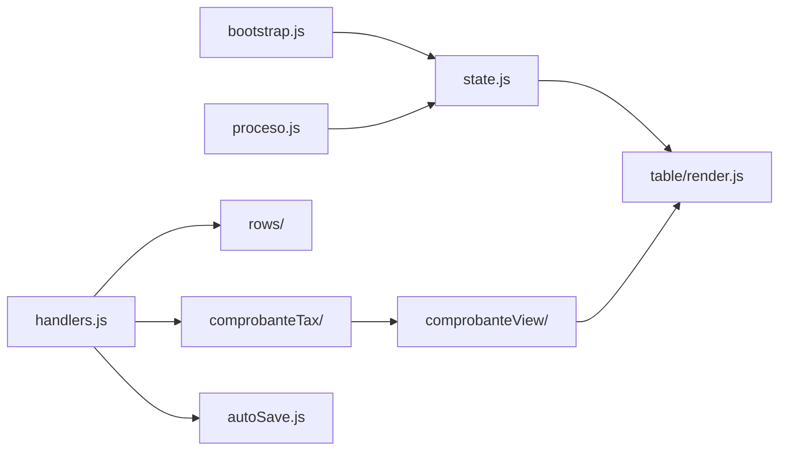

# Módulos frontend (`static/js/`)

ES modules servidos en `/js/` sin bundler. Punto de entrada: `index.html` → `main.js`.

---

## Bootstrap y estado global

| Archivo | Rol |
|---------|-----|
| `main.js` | `init()`: crea state, DOM refs, carga bootstrap, wire botones (buscar, CSV, Odoo, revertir), OC picker, auto-busca si `?proceso=` en URL. |
| `app.js` | Legacy/alternativo si existe; el flujo principal es `main.js`. |
| `core/state.js` | **`createState()`**: `rows`, `options`, `columns`, `purchaseMatching`, `comprobanteTaxModes`, flags autosave. |
| `core/dom.js` | Referencias a elementos HTML (`getDomRefs`), `setStatus`. |
| `core/handlers.js` | **`createHandlers`**: callbacks de edición celda, agregar otro impuesto, cambios que disparan re-render y autosave. |

---

## API cliente (`api/`)

| Archivo | Rol |
|---------|-----|
| `index.js` | Re-export de submódulos. |
| `bootstrap.js` | **`loadMetaAndOptions`**: GET `/api/bootstrap`; llena `state.options`, `state.columns`, perfil Odoo. |
| `proceso.js` | **`buscarProceso`**, **`revertirOriginal`**: GET proceso, PUT conversion implícito vía autosave path. |
| `procesoShared.js` | Helpers compartidos (armar query `odoo_profile`, aplicar respuesta a state). |
| `autoSave.js` | Debounce PUT `/api/proceso/{n}/conversion`; indicador `dirty` / `saveStatus`. |
| `export.js` | **`descargarCsv`**, **`importarOdoo`**, **`odooImportButtonLabel`**. |
| `purchase.js` | POST `select-oc`, `rematch-purchase`. |

Todas las llamadas deben propagar `odoo_profile` / `empresa` según `utils/url.js`.

---

## Tabla principal (`table/`)

| Archivo | Rol |
|---------|-----|
| `index.js` | Orquesta render + handlers de tabla. |
| `columns.js` | Definición de columnas visibles (alineado con `core/constants.py`). |
| `constants.js` | Keys readonly, clases CSS, índices. |
| `render.js` | Pinta `<table>`: celdas editables, combobox attach, agrupación visual por comprobante. |
| `handlers.js` | Eventos input/blur/change en celdas; sincroniza `state.rows`; llama tax sync y autosave. |
| `totals.js` | Fila de totales globales si aplica. |

---

## Vista por comprobante (`comprobanteView/`)

| Archivo | Rol |
|---------|-----|
| `index.js` | API pública del bloque comprobante (footer expandible). |
| `render.js` | HTML del pie: subtotal, IVA desglosado, otros impuestos. |
| `footer.js` | Inputs del pie; readonly según modo tax. |
| `uiState.js` | Expandido/colapsado, clases CSS por modo. |

---

## Impuestos / IVA (`comprobanteTax/`)

| Archivo | Rol |
|---------|-----|
| `index.js` | Re-exports. |
| `totals.js` | **`classifyComprobanteTaxMode`**, **`computeComprobanteTotals`** — parity con Python. |
| `lineCalc.js` | IVA sugerido por línea desde base × `iva_pct`. |
| `ivaBreakdown.js` | Desglose por alícuota en el pie. |
| `groups.js` | Agrupa `state.rows` por `__comprobante_idx`. |
| `migration.js` | Normaliza filas viejas guardadas (campos legacy). |

Ver también [iva-y-import-odoo.md](iva-y-import-odoo.md).

---

## Filas (`rows/`)

| Archivo | Rol |
|---------|-----|
| `index.js` | Helpers sobre `state.rows`. |
| `totals.js` | Sumas por comprobante / globales. |
| `otroImpuestos.js` | Slots dinámicos `otros_impuestos_N`; botón agregar impuesto. |
| `migration.js` | Migración de shape de filas al cargar. |

---

## Componentes UI

### `combobox/`

Dropdown searchable para proveedor, producto, cuenta, etc.

| Archivo | Rol |
|---------|-----|
| `index.js` | API pública. |
| `attach.js` | Monta combobox en celda. |
| `cell.js` | Valor mostrado vs id interno. |
| `dropdown.js` | Lista filtrable, keyboard nav. |

### `ocPicker/`

Selector de orden de compra cuando hay purchase matching.

| Archivo | Rol |
|---------|-----|
| `index.js` | **`wireOcPicker`**. |
| `render.js` | Modal/lista de OCs candidatas. |
| `wire.js` | Eventos selección → API `select-oc`. |

### `singleLine/`

UI para comprobantes de una sola línea (colapsar detalle).

| Archivo | Rol |
|---------|-----|
| `index.js` | Entry. |
| `collapse.js` | Toggle vista compacta. |
| `groups.js` | Detecta comprobantes single-line. |

---

## Validación (`validation/`)

| Archivo | Rol |
|---------|-----|
| `index.js` | **`validateRows`** antes de CSV/Odoo. |
| `validateRows.js` | Reglas por fila: partner, fechas, montos, documento. |
| `documentNumber.js` | Formato número latam. |

---

## Utilidades (`utils/`)

| Archivo | Rol |
|---------|-----|
| `index.js` | Re-exports. |
| `url.js` | **`getUrlParams`**, `isEmbedMode`, query `proceso`, `empresa`, `odoo_profile`. |
| `numbers.js` | Parse/format montos AR (`2.500,50`). |
| `dates.js` | Parse/format fechas. |
| `html.js` | Escape HTML, helpers DOM. |
| `options.js` | Buscar en listas de opciones por id/label. |

---

## Flujo de datos en el cliente

1. **Carga**: bootstrap → opciones + columnas → usuario busca proceso → `state.rows` + `purchaseMatching`.
2. **Edición celda**: handler → actualiza row → `syncFacIvaMontosFromLines` → re-render fila/comprobante → autosave.
3. **Export**: `validateRows` → POST `/api/csv` o `/api/odoo/import`.

---

## HTML / CSS

| Archivo | Rol |
|---------|-----|
| `static/html/index.html` | Shell: input proceso, botones, `#table-wrap`, scripts. |
| `static/css/styles.css` | Layout tabla, modos embed, comprobante footer, combobox. |

Cache bust: `routes.root()` reemplaza `?v=` con mtime de `styles.css`.

---

## Paridad con Python

| Tema | JS | Python |
|------|-----|--------|
| Modo tax | `comprobanteTax/totals.js` | `core/comprobante_tax.py` |
| Fixtures | `tests/js/comprobante_tax.test.mjs` | `tests/test_comprobante_tax.py` |
| Paridad cruzada | — | `tests/test_js_python_parity.py` |

Al cambiar fórmulas fiscales, actualizar ambos lados y `tests/fixtures/tax_scenarios.json`.

---

## URL útiles

| Query | Efecto |
|-------|--------|
| `?proceso=12345` | Auto-carga al iniciar |
| `?empresa=N` | Filtra proceso MySQL |
| `?odoo_profile=aliare` | Perfil Odoo |
| `?odoo_cloud=1` | Equivalente sudata |
| `?embed=1` | CSS compacto para iframe |
