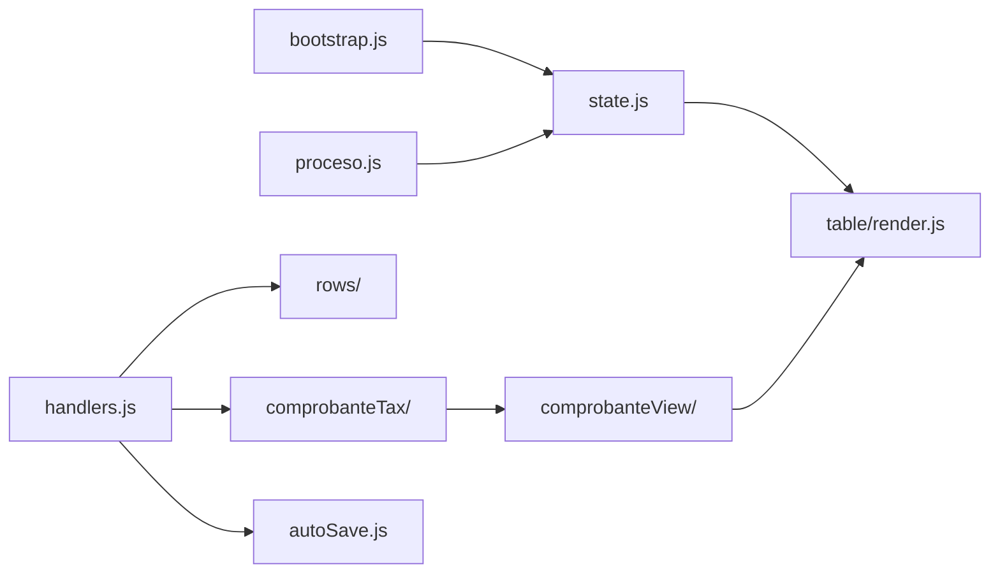

# Módulos frontend (`static/js/`)

ES modules servidos en `/js/` sin bundler. Punto de entrada: `index.html` → `main.js`.

---

## Bootstrap y estado global

| Archivo | Rol |
|---------|-----|
| `main.js` | `init()`: crea state, DOM refs, carga bootstrap, wire botones (buscar, CSV, Odoo, revertir), OC picker; delegación en `#tableWrap` para `+` / `×` de otros impuestos. Con `?proceso=` en URL: dispara **en paralelo** `fetchProcesoPayload` ∥ `loadMetaAndOptions`, aplica bootstrap y luego el payload del proceso. |
| `app.js` | Legacy/alternativo si existe; el flujo principal es `main.js`. |
| `core/state.js` | **`createState()`**: `rows`, `options`, `columns`, `purchaseMatching`, `comprobanteTaxModes`, `viewMode` / `carouselIndex` / `unifiedOneLine`, flags autosave. |
| `core/dom.js` | Referencias a elementos HTML (`getDomRefs`), `setStatus`. |
| `core/handlers.js` | **`createHandlers`**: callbacks de edición celda, agregar/quitar otro impuesto (`+` / `×`; la `×` no usa `confirm` porque en iframe FacturIA falla en silencio), cambios que disparan re-render y autosave. |

---

## API cliente (`api/`)

| Archivo | Rol |
|---------|-----|
| `index.js` | Re-export de submódulos. |
| `bootstrap.js` | **`loadMetaAndOptions`**: GET `/api/bootstrap`; llena `state.options`, `state.columns`, perfil Odoo. |
| `proceso.js` | **`fetchProcesoPayload`** (solo GET), **`buscarProceso`** (acepta `prefetched`), **`revertirOriginal`**. |
| `procesoShared.js` | Helpers compartidos (armar query `odoo_profile`, aplicar respuesta a state). **`syncPurchaseColumns`**: muestra columnas UM/OC si `show_purchase_columns` o si las filas ya traen `__um_empresa` / `__oc_line_id` (reload). UM se inserta entre Cantidad y Precio; cant. pedida/recibida y notas OC quedan antes de Subtotal/Total. |
| `autoSave.js` | Debounce PUT `/api/proceso/{n}/conversion`; indicador `dirty` / `saveStatus`. |
| `export.js` | **`descargarCsv`**, **`importarOdoo`**, **`odooImportButtonLabel`**. |
| `purchase.js` | POST `select-oc`, `rematch-purchase`, `rematch-uom` (UM al cambiar producto o al elegir UM); GET `product-uoms`; cache `state.uomOptionsByProductId`. Con `excel_user`: **Restaurar original** hace `/revert`; **Re-matchear** (`btnRematchExcel` → `rematchearExcelPadron`) relee el Sheet. |

Todas las llamadas deben propagar `odoo_profile` / `empresa` según `utils/url.js`.

---

## Tabla principal (`table/`)

| Archivo | Rol |
|---------|-----|
| `index.js` | Orquesta render + handlers de tabla. |
| `columns.js` | Definición de columnas visibles (alineado con `core/constants.py`). |
| `constants.js` | Re-export de keys / anchos (`colWidths.js`). |
| `colWidths.js` | Anchos dinámicos por contenido (fit vs flex, clamp min/max). |
| `render.js` | Pinta `<table>`: celdas editables, combobox attach, selector UM por producto (**prefetch** de opciones + fill in-place), agrupación visual por comprobante. **No inyecta** `<option>` huérfanas para ids de catálogo Odoo (proveedor/diario/cuenta/…) que no estén en `options` del tenant activo. |
| `handlers.js` | Eventos input/blur/change en celdas; sincroniza `state.rows`; llama tax sync y autosave. |
| `totals.js` | Fila de totales globales si aplica. |

---

## Vista por comprobante (`comprobanteView/`)

| Archivo | Rol |
|---------|-----|
| `index.js` | API pública del bloque comprobante (footer expandible). |
| `render.js` | Stack de tarjetas (**Lista**) o una factura (**Carrusel**); **Vista unificada** (una tabla si todas son 1 línea); `setViewMode` / `setUnifiedOneLine` / `shiftCarousel`. |
| `facturaChrome.js` | Chrome estilo **factura AFIP AR**: emisor \| letra+COD+ORIGINAL \| FACTURA+PV/nro/fecha; banda período/vto; bloque receptor; wire de campos editables (`documentLetterFromLabel`, `splitDocumentNumber`). |
| `archivoViewer.js` | Botón **Ver factura** + lightbox (PDF/imagen) vía `GET /api/proceso/{n}/archivo`. Visible si la fila trae `__fac_archivo`. |
| `footer.js` | Inputs del pie (IVA y otros por slot); **`setFooterIvaAmount`** / **`setOtrosFooterAmount`**; al elegir impuesto en columna **`syncOtrosFooterFromRowSelection`** agrega fila nombrada. |
| `uiState.js` | Scroll/foco al re-render. |

### Lista / Carrusel

- Toggle en `index.html` (`.viewModeToggle`): **Lista** = stack vertical actual; **Carrusel** = un comprobante a la vez con chrome de factura + nav `N / M`.
- Preferencia en `localStorage` clave `facturia.viewMode` (`lista` \| `carrusel`). Estado: `state.viewMode`, `state.carouselIndex` (se resetea al cargar proceso).
- **Vista unificada** (checkbox `#chkUnifiedOneLine`, solo en Lista): aparece únicamente si hay **≥2 comprobantes** y **todos son de 1 línea** (`classifyProcesoLineMode === "encabezado"`). Al activarla, colapsa el stack en **una sola tabla** (1 `thead` + scroll-x en `.comprobanteTableMount--unified`, tabla `width: max-content` para no encoger columnas). OC / Ver factura pasan a la columna Acciones de cada fila. Preferencia: `localStorage` `facturia.unifiedOneLine` / `state.unifiedOneLine`.
- Botón **Ampliar** (`▢` / `▣`): en `view-expanded` queda **solo la factura + el botón** (oculta summary, Lista/Carrusel, Vista unificada, nav, OC, total del proceso); `Esc` reduce.
- Botón **Ver factura**: abre el PDF/foto original enviado a FacturIA (`__fac_archivo` desde `archivo_original` / `file_name` en `json_data`). Requiere `FACTURIA_FILE_URL_TEMPLATE` en el servidor; sin eso el lightbox muestra error claro.
- En carrusel, `columnsForTaxMode(..., { hideChromeKeys: true })` oculta encabezado del chrome, **Notas OC/UM**, **Cant. pedida/recibida**, **Rubros**, **Diario** y **Cuenta** (`CAROUSEL_HIDE_KEYS`). Rubros/Diario/Cuenta se editan arriba en el chrome.
- Cache bust de `/` (`route_meta.root`): `?v=` = max mtime de **todo** `static/js` + `static/css` (no solo `main.js` / `render.js`); si no, un cambio solo en `columns.js` deja el grafo ES viejo en el browser.
- Flechas ←/→ cambian de comprobante si el foco no está en input/combobox.

---

## Impuestos / IVA (`comprobanteTax/`)

| Archivo | Rol |
|---------|-----|
| `index.js` | Re-exports. |
| `totals.js` | **`classifyComprobanteTaxMode`**, **`computeComprobanteTotals`** — parity con Python. |
| `lineCalc.js` | IVA sugerido por línea desde base × `iva_pct`; `lineIvaMonto` respeta `iva_monto` explícito. |
| `ivaBreakdown.js` | Desglose por alícuota en el pie; en `header`/`mixed` usa `__fac_iva_monto` si hay una sola alícuota; **`serializeFacIvaMontos`** persiste JSON (formato es-AR en strings). |
| `otrosBreakdown.js` | Desglose nombrado anclado a `amount_key` FacturIA; un label Odoo en la 1ª fila solo renombra el slot si es el mismo tipo (Interno no oculta IIBB); impuestos extra en otras líneas (IVA Adicional 20%) también van al pie; **`distributeOtrosFooterAmount`** / **`setOtrosFooterAmount`**; **`ensureOtrosLabelOnFirstRow`**, **`claimProvisionalOtrosFromLineLabels`**. |
| `groups.js` | Agrupa `state.rows` por `__comprobante_idx`. |
| `migration.js` | Normaliza filas viejas; **`migrateLegacyComprobanteIva`** solo en saves legacy (no pisa Monto IVA multi-línea); **`propagateSingleFooterIvaToLines`**: un solo IVA en el pie → `iva_pct` en todas las líneas vacías. |

Ver también [iva-y-import-odoo.md](iva-y-import-odoo.md).

---

## Filas (`rows/`)

| Archivo | Rol |
|---------|-----|
| `index.js` | Helpers sobre `state.rows`. |
| `totals.js` | **`computeRowTotal`**: en modo `line`/`mixed`, Total = subtotal + IVA + otros asignados; al quitar el IVA de la línea, Total vuelve al subtotal. No pisa `iva_monto` sticky si difiere del sugerido. |
| `otroImpuestos.js` | Slots dinámicos `otros_impuestos_N`; botón agregar impuesto. |
| `migration.js` | Migración de shape de filas al cargar. |

---

## Componentes UI

### `combobox/`

Dropdown searchable para proveedor, producto, cuenta, etc.

| Archivo | Rol |
|---------|-----|
| `index.js` | API pública. |
| `attach.js` | Monta combobox en celda. |
| `cell.js` | Valor mostrado vs id interno. |
| `dropdown.js` | Lista filtrable, keyboard nav. |

### `ocPicker/`

Selector de orden de compra cuando hay purchase matching. **UI: controles en el header de cada tarjeta de factura + modal (`<dialog>`) con tarjetas de candidatas.**

| Archivo | Rol |
|---------|-----|
| `index.js` | **`wireOcPicker`**. |
| `render.js` | **`renderOcHeaderControls`**: controles por comprobante en su header. Botón `secondary` **«Buscar OCs similares»** → «OC: {nombre} ▾» o «OC: Sin OC ▾»; `↻` re-busca. Tras reload, si hay `__selected_oc_*` / `selected_oc_by_comprobante`, prioriza la pastilla «OC: {nombre}» aunque no haya candidatos en memoria. Checkbox **«Sobreescribir precio de la OC»** (tilde + etiqueta en fila), deshabilitado sin OC; se oculta junto con el botón si el proveedor no tiene OCs. La barra global `#ocPickerBar` queda oculta (legacy). El modal incluye **buscador** (nombre/ref/producto) + filtro **Desde** (mes, default ene-2026); foco en el buscador al abrir. |
| `wire.js` | Delegación de eventos en `#tableWrap`: buscar/abrir (ignora botones `disabled`); si se intenta abrir sin candidatos, ejecuta `searchOc` primero; change del checkbox → `__overwrite_oc_price` + autosave; modal → `selectOc` / filtro del buscador. `searchOc` pone el CTA/pastilla en **«Buscando…»** mientras dura la llamada. |

API: `POST /api/proceso/{n}/search-oc` (candidatos bajo demanda), `POST .../select-oc` (`order_id=0` = Sin OC / deseleccionar) y `POST .../rematch-purchase` al cambiar proveedor. El rematch actualiza `oc_provider_has_ocs_by_comprobante` y hace aparecer/desaparecer el botón dinámicamente. Elegir Sin OC no elimina el acceso al selector.

### `singleLine/`

UI para modo **Solo encabezado** / **1 línea** (`__solo_encabezado`, detección por cantidad de filas).

| Archivo | Rol |
|---------|-----|
| `index.js` | Entry. |
| `collapse.js` | Colapsa multi-línea a una fila (`__solo_encabezado` + backup `__solo_encabezado_backup`); pisa IVA/otros de línea con montos FacturIA; `expandSoloEncabezadoAtRow` restaura al destildar. |
| `groups.js` | Bounds por comprobante; **`isSoloEncabezado`**, **`isEncabezadoOneLineUi`**. |
| `procesoMode.js` | **`classifyProcesoLineMode`** / **`mixedProcesoLineModeError`** por conteo de filas (1 vs >1). Un proceso no mezcla Encabezado y con Líneas. |

Con **1 línea** por comprobante: **sin pie**; montos IVA/otros en la fila (`__ui_one_line`). Con **varias líneas**: pie visible. La columna **Subtotal** es **siempre** visible antes de **Total**.

---

## Validación (`validation/`)

| Archivo | Rol |
|---------|-----|
| `index.js` | **`validateRows`** antes de CSV/Odoo. |
| `validateRows.js` | Antes de CSV/Odoo: `partner_id` y `journal_id` (1ª fila del comprobante); `iva_pct` solo en modo **line** (en header/mixed el IVA está en el pie); número de documento, cuenta si hay línea, fechas y numéricos. |
| `documentNumber.js` | Formato número latam. |

---

## Utilidades (`utils/`)

| Archivo | Rol |
|---------|-----|
| `index.js` | Re-exports. |
| `url.js` | **`getUrlParams`**, `isEmbedMode`, `isDebugMode` (`?debug=1` para timing en consola), query `proceso`, `empresa`, `odoo_profile`. |
| `numbers.js` | Parse/format montos AR (`2.500,50`); **`sanitizeNumericString`** para híbridos (`350.0,00`); **`toNumberLoose`** no colapsa decimales US con parte entera >3 dígitos (`1457.256`); usado en pie IVA y otros impuestos. |
| `dates.js` | Parse/format fechas. |
| `html.js` | Escape HTML, helpers DOM. |
| `options.js` | Buscar en listas de opciones por id/label. |

---

## Flujo de datos en el cliente

```mermaid
flowchart LR
  bootstrap[bootstrap.js] --> state[state.js]
  proceso[proceso.js] --> state
  handlers[handlers.js] --> rows[rows/]
  handlers --> tax[comprobanteTax/]
  handlers --> autoSave[autoSave.js]
  tax --> compView[comprobanteView/]
  state --> table[table/render.js]
  compView --> table
```

1. **Carga**: bootstrap → opciones + columnas → usuario busca proceso → `state.rows` + `purchaseMatching`. Deep-link (`?proceso=`): fetch bootstrap ∥ proceso; apply en ese orden.
2. **Edición celda**: handler → actualiza row → `syncFacIvaMontosFromLines` → re-render fila/comprobante → autosave.
3. **Export**: `validateRows` → POST `/api/csv` o `/api/odoo/import`.

---

## HTML / CSS

| Archivo | Rol |
|---------|-----|
| `static/html/index.html` | Shell: input proceso, botones, toggle Lista/Carrusel, nav carrusel, pestañas Edición/FacturIA (dev), `#tableWrap`, scripts. |
| `static/html/padron_excel.html` | UI padrón Excel/Sheets (clientes sin Odoo). `?embed=1&proceso=` para iframe FacturIA. Deep link UI principal: `/?excel_user=1&proceso=` (ver [padron-excel.md](padron-excel.md)). |
| `static/js/padronExcel/app.js` | Config fuentes (pub / spreadsheet_id+SA / upload), CRUD facturas, deep-link proceso → match. |
| `static/js/facturiaRaw/tab.js` | Pestaña **FacturIA** (solo `ui_env=dev`): `GET .../facturia-raw`. |
| `static/css/styles.css` | Layout tabla, modos embed, comprobante footer, combobox, chrome factura / toggle vista. |

**Scroll / pies fijos**

| Contenedor | Scroll | Qué queda fijo |
|------------|--------|----------------|
| `.tableScroll` | **vertical** (lista) con `max-height` | badges + toggle vista + **Total del proceso** (`.footerBar` fuera del scroll) |
| `.comprobanteTableMount` | horizontal por tarjeta | header OC / chrome factura + pie del comprobante |
| Carrusel | un `.comprobanteCard--factura` | nav `#carouselNav` fuera del scroll |

En embed/deep-link: `html/body` con `overflow: hidden` + flex; solo scrollea `.tableScroll`. El Total del proceso queda siempre visible abajo de la tarjeta.

Cache bust: `routes.root()` reemplaza `?v=` con mtime de `styles.css`.

---

## Paridad con Python

| Tema | JS | Python |
|------|-----|--------|
| Modo tax | `comprobanteTax/totals.js` | `core/comprobante_tax.py` |
| Fixtures | `tests/js/comprobante_tax.test.mjs` | `tests/test_comprobante_tax.py` |
| Paridad cruzada | — | `tests/test_js_python_parity.py` |

Al cambiar fórmulas fiscales, actualizar ambos lados y `tests/fixtures/tax_scenarios.json`.

---

## URL útiles

| Query | Efecto |
|-------|--------|
| `?proceso=12345` | Auto-carga al iniciar |
| `?empresa=N` | Filtra proceso MySQL |
| `?odoo_profile=aliare` | Perfil Odoo |
| `?odoo_cloud=1` | Equivalente sudata |
| `?embed=1` | CSS compacto para iframe |
| `?import_id=&token=` | Callback FacturIA (`process_erp_imports`); tras **Importar a Odoo** se notifica el webhook |
| Pestaña **FacturIA** | Solo si bootstrap `ui_env=dev` (staging / `PROCESS_SCHEMA` con `staging`) — JSON crudo `GET /api/proceso/{n}/facturia-raw` |
